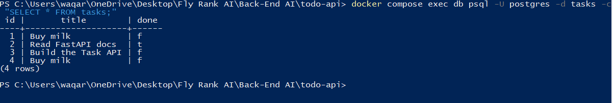

# Task API

A to-do list API built with **FastAPI** for the FlyRank Internship —
Backend Track. It supports full CRUD (Create, Read, Update, Delete) on tasks,
with input validation, correct HTTP status codes, and interactive docs via Swagger UI.

Storage has evolved across assignments: in-memory (A1) -> SQLite file (A2) ->
**PostgreSQL running in Docker (A3, this version)**.

## How to install & run

    # 1. Clone this repo, then from the project folder:
    cp .env.example .env

    # 2. Start everything with one command (app + Postgres database)
    docker compose up

The API is now running at http://localhost:8000
Interactive Swagger docs: http://localhost:8000/docs

## Endpoints

| Method | Path            | Description                        | Success | Errors   |
|--------|-----------------|-------------------------------------|---------|----------|
| GET    | /               | API info                            | 200     | -        |
| GET    | /health         | Health check                        | 200     | -        |
| GET    | /tasks          | List all tasks                      | 200     | -        |
| GET    | /tasks/{id}     | Get one task                        | 200     | 404      |
| POST   | /tasks          | Create a task                       | 201     | 400      |
| PUT    | /tasks/{id}     | Update a task's title and/or done   | 200     | 400, 404 |
| DELETE | /tasks/{id}     | Delete a task                       | 204     | 404      |

## Example request

    curl -i -X POST http://localhost:8000/tasks -H "Content-Type: application/json" -d "{\"title\":\"Buy milk\"}"

    HTTP/1.1 201 Created
    content-type: application/json

    {"id":4,"title":"Buy milk","done":false}

## Swagger UI

## Database

This project uses PostgreSQL, running in a Docker container.

Why Postgres: it is the same engine behind a huge share of real-world
backends. Unlike SQLite (a single file), Postgres runs as its own server
process.

Where it lives: inside a Docker container named db, with its data stored
in a named Docker volume (taskdata) so it survives restarts.

Connection: the app reads DATABASE_URL from a .env file (git-ignored).
A .env.example is committed with a placeholder value.

Run it:

    docker compose up

Persistence proof: created a task via the API, ran docker compose down
then docker compose up again, and GET /tasks still returned all 4 tasks -
confirming the Docker volume kept the data safe across a full restart.

Screenshot of data in Postgres:
