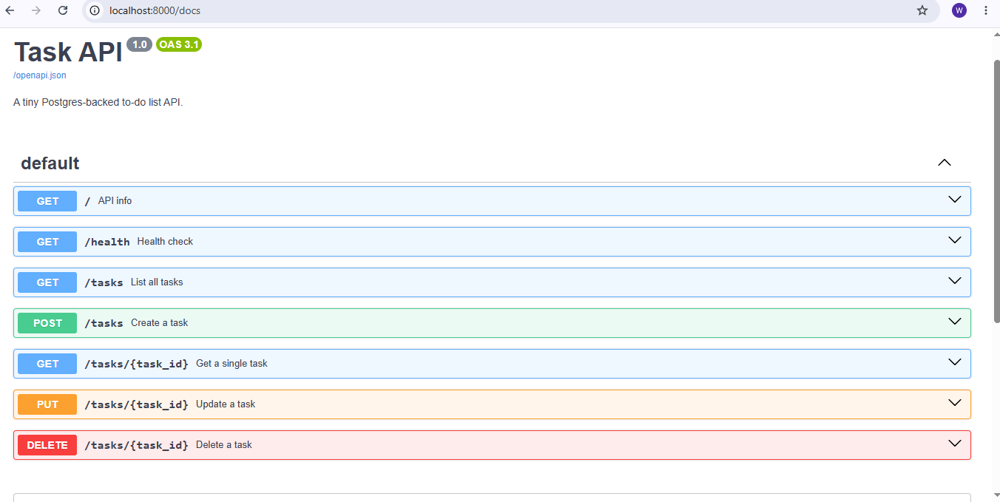
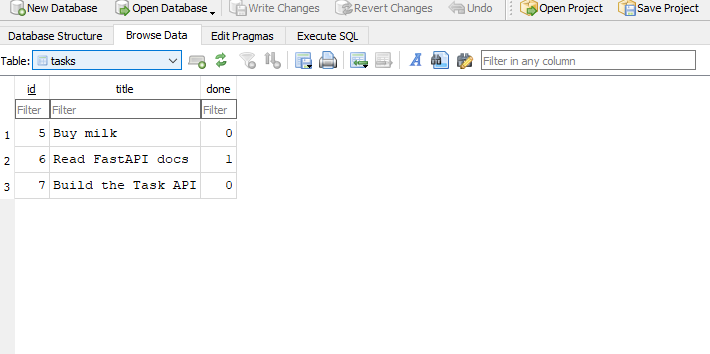

# Task API

A small in-memory to-do list API built with **FastAPI** for the FlyRank Internship —
Backend Track, Week 2, Assignment A1 (Build your first CRUD API).

It supports full CRUD (Create, Read, Update, Delete) on an in-memory list of tasks,
with input validation, correct HTTP status codes, and interactive docs via Swagger UI.

## How to install & run

```bash
# 1. Clone this repo, then from the project folder:
pip install -r requirements.txt

# 2. Start the server
uvicorn main:app --reload
```

The API is now running at `http://localhost:8000`.
Interactive Swagger docs: `http://localhost:8000/docs`

## Endpoints

| Method | Path            | Description                     | Success | Errors        |
|--------|-----------------|----------------------------------|---------|----------------|
| GET    | `/`             | API info                         | 200     | —              |
| GET    | `/health`       | Health check                     | 200     | —              |
| GET    | `/tasks`        | List all tasks (supports `?done=`, `?search=`, `?limit=`, `?offset=`) | 200 | — |
| GET    | `/tasks/{id}`   | Get one task                     | 200     | 404            |
| POST   | `/tasks`        | Create a task (`{"title": "..."}`) | 201   | 400            |
| PUT    | `/tasks/{id}`   | Update a task's title and/or done | 200    | 400, 404       |
| DELETE | `/tasks/{id}`   | Delete a task                    | 204     | 404            |
| GET    | `/stats`        | Task counts (total/done/open)    | 200     | —              |
| POST   | `/reset`        | Reset to the 3 example tasks     | 200     | —              |

## Example request

```
$ curl -i -X POST http://localhost:8000/tasks -H "Content-Type: application/json" -d '{"title":"Buy milk"}'

<< PASTE YOUR curl -i OUTPUT HERE >>
```

## Swagger UI

<< PASTE YOUR SCREENSHOT HERE, e.g.  >>

## The mortality experiment (optional)

<< After creating a few tasks and restarting the server, write 1-2 sentences here
about what happened to your data and why. >>

## AI vs me (Bonus Stage 7)

**My prompt:**
```
<< PASTE THE PROMPT YOU WROTE YOURSELF HERE >>
```

**What the AI did better:**
<< your answer >>

**What it got wrong or quietly ignored:**
<< your answer >>

**What my prompt forgot to specify:**
<< your answer >>

**After the rematch, what changed:**
<< one sentence >>
The curl output from Step 12 (the 201 Created one)
A sentence or two for the "mortality experiment" section (restart your server, run curl.exe -i http://localhost:8000/tasks, notice your added tasks are gone — write why: it's all in-memory, nothing saved to disk)
## Database

This project uses **SQLite** for storage.

**Why SQLite:** it's a single file (`tasks.db`), needs no separate server or
install, and — unlike the in-memory version from Assignment 1 — data survives
a restart.

**Where it lives:** `tasks.db` in the project root. It's auto-created on first
run and is git-ignored, so every fresh clone starts with a clean database.

**Run it:**
\`\`\`
uvicorn main:app --reload
\`\`\`

**Example SQL query** (run by hand in DB Browser, Stage 4):
\`\`\`sql
SELECT COUNT(*) FROM tasks;
\`\`\`
Returned `4` before running `UPDATE tasks SET done = 1;` followed by
`DELETE FROM tasks WHERE done = 1;` — and `0` immediately after, proving
DB Browser and the API share the exact same file with no syncing needed.

**Screenshot:**
